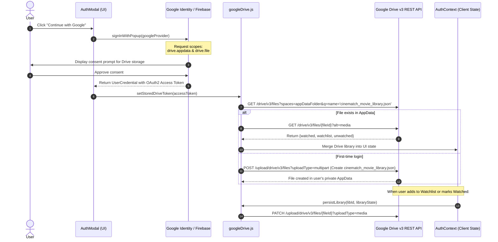

# Movie Recommendation Engine: End-to-End System Architecture

## 1. Executive Summary

The **Movie Recommendation Engine** is an intelligent, high-performance media discovery platform spanning **Movies, TV Series, Anime, and Korean Dramas (K-Dramas)**. It integrates:
1. **Live TMDB v3 catalog streaming** with Rotten Tomatoes 🍅 Tomatometer and IMDb ⭐ critical scores.
2. **Sub-navigation Watchlist shelf** docked below the header with smooth scrolling and automated queue management.
3. **Actor and director filmography search** with instant credit roll inspection.
4. **Interactive gesture- and keyboard-driven Swipe Mode** for rapid taste calibration.
5. **A vector-based hybrid recommendation system** featuring franchise anti-clustering and strict candidate exclusions.
6. **100% private user data storage in Google Drive** (`appDataFolder`) paired with Cloud Firestore fallback synchronization.
7. **A direct-launch "Where to Stream & Watch Now" hub** supporting multiple regions including Nepal (🇳🇵).
8. **Discreet "Not Interested" Engine**: Zero navigation bar clutter with strict, permanent exclusion across recommendations, swipe decks, and category feeds.
9. **Rate & Review Hub**: Top-of-modal personal rating (1-10 stars), private review journaling, and direct 1-click launch links to write reviews on IMDb and Letterboxd.
10. **All-Time Top 250 Media Rankings**: Dedicated rankings for Top 250 Movies, Top 250 TV Series, and Top 250 Anime of All Time with #1..#250 podium badges, watch progress tracking, and 24-hr caching.

---

## 2. System Architecture Diagram

```mermaid
flowchart TD
    subgraph ClientLayer["Frontend Client (React 18 + Vite + Tailwind CSS)"]
        UI["Cinema Dark UI & Navigation"]
        WatchlistShelf["Watchlist Shelf (Sub-Nav Dock)"]
        AuthCtx["Auth Context & Sync Engine"]
        SwipeUI["Swipe Mode Deck & Controls"]
        StreamHub["Where to Stream Modal"]
        ActorDrawer["Actor Filmography Drawer"]
        Top250Modal["Top 250 Hall of Fame Modal"]
        ReviewHub["Rate & Review Hub (IMDb / Letterboxd)"]
        MovieGrid["Dynamic FYP & Category Rows"]
    end

    subgraph APILayer["FastAPI Gateway (Asynchronous Python 3.11)"]
        RouterRec["/api/recommendations/*"]
        RouterMovies["/api/movies/* (Catalog, Credits, Top 250)"]
        RouterUsers["/api/users/* (Watched, Watchlist, Not-Interested, Export)"]
        AuthMiddleware["Firebase Auth & Token Verifier"]
    end

    subgraph EngineLayer["Core Recommender & Vector Store"]
        RecEngine["Hybrid Recommender Service"]
        VectorStore["TF-IDF Vector Store (10k Catalog)"]
        FranchiseEngine["Franchise Satiation & Diversity Re-Ranker"]
        ExclusionFilter["Exclusion Guard (Watched ∪ Unwatched ∪ Watchlist ∪ Not-Interested)"]
        GenreGuards["Format & Strict K-Drama Guards"]
        Top250Engine["Top 250 Engine (24-hr Multi-Page TMDB Cache)"]
    end

    subgraph StorageLayer["Data & Persistence Layers"]
        GDrive[("Personal Google Drive (appDataFolder)")]
        Firestore[("Cloud Firestore (Production Remote)")]
        DevStore[("Local JSON Cache (Dev Fallback)")]
        DatasetCSV[("dataset.csv (Normalized Catalog)")]
        LocalStorage[("Browser LocalStorage (Zero-Latency Cache)")]
    end

    subgraph ExternalAPIs["External Services"]
        TMDB["TMDB API v3 (Live Streaming, Credits, Top 250)"]
        OMDb["OMDb API (Rotten Tomatoes & IMDb)"]
        FirebaseSSO["Firebase Google SSO"]
        GDriveAPI["Google Drive v3 REST API"]
        ExtReview["IMDb & Letterboxd Review Portals"]
    end

    %% Client Layer Internal Flows
    UI --> WatchlistShelf
    UI --> AuthCtx
    UI --> SwipeUI
    UI --> StreamHub
    UI --> ActorDrawer
    UI --> Top250Modal
    UI --> MovieGrid
    MovieGrid --> ReviewHub
    AuthCtx <--> LocalStorage
    AuthCtx <--> FirebaseSSO
    AuthCtx <--> GDriveAPI

    %% Client to API Gateway
    SwipeUI -->|Swipe Events| RouterRec
    MovieGrid -->|Get FYP Feed| RouterRec
    ActorDrawer -->|Fetch Credits| RouterMovies
    StreamHub -->|Fetch Providers| RouterMovies
    Top250Modal -->|Fetch Top 250| RouterMovies
    WatchlistShelf -->|Toggle Watchlist| RouterUsers
    AuthCtx -->|Sync Records| RouterUsers
    ReviewHub -->|1-Click Deep Links| ExtReview

    %% Gateway to Middleware & Services
    RouterRec --> AuthMiddleware
    RouterUsers --> AuthMiddleware
    RouterRec --> RecEngine
    RouterMovies --> TMDB
    RouterMovies --> OMDb
    RouterMovies --> Top250Engine

    %% Core Engine Pipeline
    RecEngine --> VectorStore
    RecEngine --> FranchiseEngine
    RecEngine --> ExclusionFilter
    RecEngine --> GenreGuards
    VectorStore --> DatasetCSV
    Top250Engine --> TMDB

    %% Engine to External & Persistence
    RecEngine --> TMDB
    RecEngine --> OMDb
    RouterUsers --> Firestore
    RouterUsers --> DevStore
    GDriveAPI --> GDrive
```



---

## 3. Core Architectural Subsystems

### 3.1 Frontend Single Page Application (SPA)

* **Framework**: React 18 with Vite for rapid Hot Module Replacement (HMR) and sub-second asset bundling.
* **Styling**: Tailwind CSS adhering to [`STYLE_GUIDE.md`](./STYLE_GUIDE.md) — deep cinema carbon (`#09090b`), clean zinc borders (`#27272a`), amber star badges, and zero distracting neon elements.
* **Component Architecture**:
  * `Navbar.jsx`: Global search with typeahead matching movies, shows, anime, and actors; format filters; direct links to Swipe Mode, Watchlist shelf, Watched drawer, and the All-Time Top 250 Hall of Fame. Zero navbar pollution from "Not Interested" filters.
  * `Top250Modal.jsx`: Hall of Fame modal featuring Top 250 Movies, Top 250 TV Series, and Top 250 Anime of All Time. Includes podium badges (#1 👑, #2 🥈, #3 🥉, #4..#250), live watch progress bar ("Watched X of 250"), search filter, and category tab switching.
  * `WatchlistShelf.jsx`: Interactive sub-navigation shelf docked directly below the header. Supports smooth scrolling, quick-view, one-click watch toggle, and removal.
  * `SwipeDeckModal.jsx`: Gestural card swiping (mouse/trackpad), clickable floating arrow buttons, and full keyboard navigation (<kbd>←</kbd> Skip, <kbd>→</kbd> Watched, <kbd>↑</kbd>/<kbd>↓</kbd> Genre cycling, <kbd>Esc</kbd> Close). Automatically excludes all watched, saved, and not-interested titles.
  * `MovieCard.jsx`: High-resolution poster rendering, format badges, Rotten Tomatoes 🍅 Tomatometer, IMDb ⭐ scores, one-click Watchlist / Watched buttons, and discreet `EyeOff` "Not Interested" quick action.
  * `MovieModal.jsx`: Detailed metadata, YouTube trailer embed, director/cast list, **Where to Stream** hub, and top-docked **Rate & Review Hub** with personal 1-10 star rating, review notes, direct launch to IMDb/Letterboxd, and "Not Interested" action.
  * `WatchedDrawer.jsx`: Slide-out panel for browsing watched titles and queued watchlist, updating personal ratings and reviews, inspecting sync status, and exporting watch history to JSON/CSV.
  * `AuthModal.jsx`: Consumer-friendly Google SSO dialog clearly explaining the private Google Drive storage permission.

---

### 3.2 Personal Google Drive Cloud Storage Subsystem (`googleDrive.js`)

To ensure **100% user data ownership**, zero server storage bloat, and seamless cross-device synchronization without exposing technical database IDs:



#### Key Properties of the Google Drive Architecture:
1. **Private `appDataFolder`**: The library file `cinematch_movie_library.json` is stored inside Google Drive's hidden application data directory. It never clutters the user's primary "My Drive" file listing.
2. **Zero Technical Jargon**: The user never sees database UIDs, hashes, or manual sync buttons. The sync happens transparently whenever they sign in with Google.
3. **Dual-Layer Resilience**: If the Google Drive OAuth token expires (typically 1 hour), the client automatically falls back to Cloud Firestore and browser `localStorage` as real-time local caches until the next login.

---

### 3.3 Watchlist Shelf Subsystem & Auto-Move Workflow

The Watchlist system provides a queue of titles the user plans to watch:

1. **Sub-Navigation Placement**: Docked directly underneath the top navigation bar, accessible with one click from the navbar badge.
2. **Auto-Move from Watchlist to Watched**:
   * When a user marks a title as *Watched* (via Swipe Mode, MovieCard, or MovieModal), the system checks if the title exists in `watchlistIds`.
   * If present, it automatically removes it from the Watchlist and inserts it into the Watched collection.
   * Both collections are synchronously persisted to Google Drive and Firestore.
3. **Recommendation & Deck Exclusion**:
   * Any title residing in `watchlistIds` is strictly excluded from candidate recommendation feeds and Swipe decks. Users are never recommended titles they have already saved.

---

### 3.4 Actor & Cast Filmography Subsystem

Users can search for any actor, actress, or director:
* **Endpoint**: `GET /api/movies/person/{person_id}/credits`
* **Metadata Extraction**: Retrieves complete filmography from TMDB (`/person/{id}/movie_credits` and `/person/{id}/tv_credits`).
* **Interactive Dropdown**:
  * Displays the person's profile picture, biography, and full cast/crew credits.
  * Sorted by popularity and release date.
  * Clicking any credit launches the rich movie modal with ratings, trailer, and streaming providers.

---

### 3.5 Hybrid Recommender Service & Vector Space

#### A. In-Memory TF-IDF Vector Space
* **Catalog**: 10,000 titles normalized from `dataset.csv`.
* **Tokenization**: Title, overview tokens, genres, and format indicators vectorized into a sparse TF-IDF matrix.
* **Cosine Similarity**:
  $$\text{sim}(\vec{u}, \vec{m}) = \frac{\vec{u} \cdot \vec{m}}{\|\vec{u}\| \|\vec{m}\|}$$

#### B. User Taste Centroid Formulation
When an authenticated user marks titles as watched, a user centroid $\vec{C}_u$ is computed:
$$\vec{C}_u = \frac{1}{|W_u|} \sum_{i \in W_u} w_i \vec{m}_i$$
where $W_u$ represents the user's liked titles and $w_i$ is a weighting factor derived from their user rating ($\ge 7.0$).

#### C. Strict Candidate Exclusion Formula
Candidates $\mathcal{C}$ are filtered against all user interaction sets:
$$\mathcal{C}_{final} = \mathcal{M}_{catalog} \setminus \left( \mathcal{W}_{watched} \cup \mathcal{U}_{unwatched} \cup \mathcal{L}_{watchlist} \right)$$
This guarantees that watched movies, skipped movies, and saved watchlist movies never pollute candidate pools.

#### D. Franchise Anti-Clustering & Alternate Hero Injection
1. **Franchise Satiation**: If $\ge 2$ watched titles match a known franchise (e.g. Batman), that franchise is flagged as saturated.
2. **Top Row Alternates (`FYP: Top Alternates For You`)**:
   * Suppresses saturated franchise tokens from the query centroid.
   * Injects high-rated alternate heroes and blockbusters (*Iron Man, Superman, Spider-Man: Into the Spider-Verse, Logan, The Avengers, John Wick, Mad Max: Fury Road, Watchmen*).
   * Applies Diversity Re-Ranking (Maximal Marginal Relevance) to prevent sequel clustering.
3. **Dedicated Universe Section Below**:
   * Lower row (**`Because You Watched Batman: Extended Lore & Universe`**) is curated for completionists.

#### E. Strict Format & Genre Guards
* **K-Drama Guard**: Strict requirement that K-Drama sections only appear if `kdrama_count > 0`.
* **Anime Adaptation**: Anime rows dynamically adapt their title based on user history:
  * Action fans $\rightarrow$ **High-Octane Anime & Animation**
  * Drama/Romance fans $\rightarrow$ **Story-Rich & Emotional Anime**
  * Anime fans $\rightarrow$ **Anime For You**

---

### 3.6 "Where to Stream & Watch Now" Hub

* **Endpoint**: `GET /api/movies/{id}/providers?media_type={type}&country={country_code}&title={title}`
* **Categorization**: Flatrate subscription, free with ads, rent, or buy.
* **Direct Deep-Links**: Direct search/launch URLs for:
  * **Netflix**: `https://www.netflix.com/search?q={title}`
  * **Prime Video**: `https://www.amazon.com/s?k={title}&i=instant-video`
  * **Disney+**: `https://www.disneyplus.com/search?q={title}`
  * **Crunchyroll**: `https://www.crunchyroll.com/search?q={title}`
  * **Apple TV**: `https://tv.apple.com/search?term={title}`
* **Regional Support**: Country switcher supporting 🇳🇵 Nepal, 🇺🇸 United States, 🇬🇧 United Kingdom, 🇨🇦 Canada, 🇦🇺 Australia, 🇯🇵 Japan, 🇰🇷 South Korea, 🇮🇳 India, 🇩🇪 Germany, and 🇫🇷 France.

---

### 3.7 Discreet "Not Interested" Engine & Permanent Suppression

To maintain an uncluttered discovery experience without annoying the user with repetitive suggestions:
* **Zero Navigation Clutter**: Strictly obeys UI design constraints by avoiding any "Not Interested" tab, badge, or button in the top navigation bar.
* **Discreet Interaction**: Users can mark titles as "Not Interested" via the subtle `EyeOff` quick-action icon on `MovieCard` or the secondary action button in `MovieModal`.
* **Universal Candidate Suppression**:
  * Added to `get_all_excluded_ids(user_id)`:
    $$\mathcal{C}_{final} = \mathcal{M}_{catalog} \setminus \left( \mathcal{W}_{watched} \cup \mathcal{U}_{unwatched} \cup \mathcal{L}_{watchlist} \cup \mathcal{N}_{not\_interested} \right)$$
  * Any title in $\mathcal{N}_{not\_interested}$ is immediately stripped from FYP feeds, category carousels, genre recommendations, and the Swipe Mode deck.
* **CRUD Endpoints**:
  * `GET /api/users/not-interested`
  * `POST /api/users/not-interested`
  * `DELETE /api/users/not-interested/{movie_id}`
* **Multi-Layer Synchronization**: Persisted across browser `localStorage`, Cloud Firestore, and Google Drive `appDataFolder`.

---

### 3.8 Rate & Review Hub with Direct IMDb & Letterboxd Launch

To streamline personal logging and community reviewing:
* **Top-of-Modal Placement**: Positioned at the very top of `MovieModal` above cast and trailers so users can immediately rate and journal thoughts.
* **Interactive 1-10 Star Rating**: High-precision 10-star rating bar with hover highlights and clear score displays.
* **Personal Review Journaling**: Inline textarea for personal commentary and reviews, stored directly in the watched record (`review: Optional[str]`).
* **Direct 1-Click External Platform Launchers**:
  * **IMDb Reviews**: Automatically navigates to `https://www.imdb.com/title/{imdb_id}/reviews` (falling back to direct search).
  * **Letterboxd**: Direct title query deep-link to `https://letterboxd.com/search/{encoded_title}/` for rapid logging on the social movie community.
* **Watched Drawer Snippet**: Personal review quotes appear directly under watched titles in `WatchedDrawer.jsx`.

---

### 3.9 All-Time Top 250 Media Rankings Engine

A dedicated Hall of Fame browsing engine for curated, all-time prestige media:
* **Endpoint**: `GET /api/movies/top-250?category=movies|tv|anime&page=1&limit=50`
* **Categories Supported**:
  1. **Top 250 Movies of All Time**: TMDB Top Rated Feature Films.
  2. **Top 250 TV Series of All Time**: TMDB Top Rated Television & Limited Series.
  3. **Top 250 Anime of All Time**: Japanese Animation series and films (`with_genres=16`, `with_original_language=ja`).
* **Rankings & Badging**: Dynamic rank calculation (`#1` to `#250`), with Olympic podium badges for `#1` 👑 (Gold), `#2` 🥈 (Silver), `#3` 🥉 (Bronze), and slate badges for `#4` through `#250`.
* **Personal Progress Tracker**: Calculates completion percentage in real time (`Watched X of 250 titles`) against the user's watched collection with an animated progress bar.
* **High-Efficiency Caching**: Concurrently fetches pages 1–13 from TMDB and caches the compiled 250 entries in-memory for 24 hours (86,400s TTL) with offline fallback data.

---

## 4. Data Models & Schemas

### 4.1 Watched Record Schema
```json
{
  "id": 155,
  "title": "The Dark Knight",
  "poster_url": "https://image.tmdb.org/t/p/w500/qJ2tW6WMUDux911r6m7haRef0WH.jpg",
  "year": "2008",
  "vote_average": 8.5,
  "genres": ["Action", "Crime", "Drama", "Thriller"],
  "media_type": "movie",
  "watched_at": 1726678900.0,
  "rating": 9.5,
  "review": "A masterpiece in modern superhero cinema. Ledger's performance is legendary."
}
```

### 4.2 Watchlist Record Schema
```json
{
  "id": 27205,
  "title": "Inception",
  "poster_url": "https://image.tmdb.org/t/p/w500/oYuLEt3zVCKq57qu2F8dT7NIa6f.jpg",
  "backdrop_url": "https://image.tmdb.org/t/p/w1280/s3TBrRGB1iav7gFOCNx3H31MoES.jpg",
  "year": "2010",
  "vote_average": 8.4,
  "genres": ["Action", "Science Fiction", "Adventure"],
  "media_type": "movie",
  "added_at": 1726679500.0,
  "rotten_tomatoes": "87%",
  "imdb_rating": "8.8"
}
```

### 4.3 Not Interested Record Schema
```json
{
  "id": 105,
  "title": "Back to the Future Part II",
  "poster_url": "https://image.tmdb.org/t/p/w500/yrn3rV4bZ4vDq590oQoO7Ue0aB7.jpg",
  "year": "1989",
  "genres": ["Adventure", "Comedy", "Science Fiction"],
  "media_type": "movie",
  "marked_at": 1726680500.0
}
```

### 4.4 Google Drive Storage Payload (`cinematch_movie_library.json`)
```json
{
  "app": "MovieRecommendation",
  "version": "1.0",
  "updated_at": 1726680000000,
  "watched": [ /* array of watched records with ratings and reviews */ ],
  "watchlist": [ /* array of watchlist records */ ],
  "unwatched": [ /* array of skipped records */ ],
  "not_interested": [ /* array of not-interested records */ ]
}
```

---

## 5. Security & Privacy Architecture

1. **Google Drive Permission Scoping**: Requests only `drive.appdata` (private folder) and `drive.file` (app-created files). The application can never read or access the user's personal documents, photos, or spreadsheets.
2. **Bearer Token Authentication**: All user-specific backend endpoints require a valid Firebase ID token in the `Authorization: Bearer <token>` header.
3. **Internal Unwatched & Not Interested Security**: Skipped and suppressed titles are never shared publicly or displayed in the user's visible library.
4. **CORS Hardening**: Strict origin whitelisting (`movierecommendation.pages.dev`, `localhost:5173`).
5. **No Media Piracy**: The system does not stream or host copyrighted media files; it acts purely as a discovery, scoring, and deep-linking platform.

---

## 6. Automated Verification & Testing Suite

All 15 backend test suites pass in [`backend/tests/test_backend.py`](file:///Users/sahas/Documents/Projects/MovieRecommendation/backend/tests/test_backend.py):

| Test Name | Architectural Verification | Status |
|---|---|---|
| `test_health_check` | Validates API status, vector store warm-up, and catalog availability. | ✅ Passed |
| `test_vector_store_similarity` | Verifies cosine similarity computation and self-exclusion. | ✅ Passed |
| `test_watched_movie_exclusion` | Enforces strict exclusion of watched titles from recommendation candidates. | ✅ Passed |
| `test_guest_recommendations_feed` | Verifies public multi-section discovery feeds for unauthenticated guests. | ✅ Passed |
| `test_user_watched_and_export` | Validates authenticated watch logging and JSON/CSV data export. | ✅ Passed |
| `test_watch_providers_and_direct_links` | Verifies TMDB provider extraction and direct search deep-links. | ✅ Passed |
| `test_unwatched_tracking_and_exclusion` | Verifies that skipped titles are stored and excluded from subsequent swipe decks. | ✅ Passed |
| `test_franchise_anti_clustering_and_alternates` | Verifies that watching multiple Batman titles recommends alternate heroes at the top and places Batman lore in a lower section. | ✅ Passed |
| `test_kdrama_recommendation_strict_guard` | Enforces that non-K-Drama viewers are never shown "Because you loved K-drama". | ✅ Passed |
| `test_user_watchlist_and_auto_move_to_watched` | Verifies adding to Watchlist and automatic removal upon marking as watched. | ✅ Passed |
| `test_actor_search_and_filmography` | Verifies actor credit retrieval (`/movies/person/{id}/credits`) and filmography listing. | ✅ Passed |
| `test_watchlist_exclusion_from_feed_and_recommendations` | Enforces that Watchlist items are strictly excluded from recommendation feeds. | ✅ Passed |
| `test_not_interested_tracking_and_exclusion` | Enforces marking titles as Not Interested, backend CRUD, and permanent exclusion from recommendations. | ✅ Passed |
| `test_mark_watched_with_rating_and_review` | Validates saving watched items with custom 1-10 star rating and personal review notes. | ✅ Passed |
| `test_top_250_rankings` | Verifies Top 250 endpoint across Movies, TV Series, and Anime with rank annotations #1..#250. | ✅ Passed |

