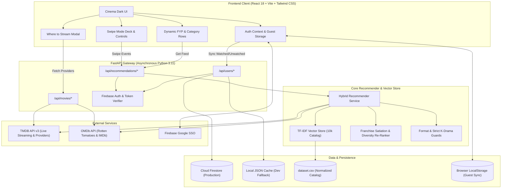
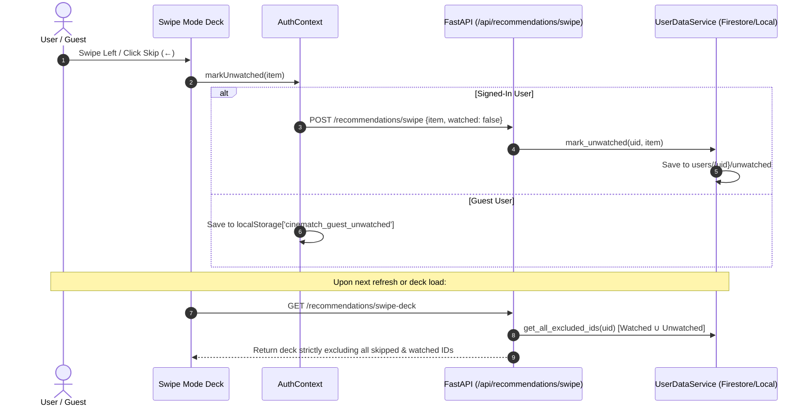

# Movie Recommendation Engine: End-to-End System Architecture

## 1. Executive Summary

The **Movie Recommendation Engine** is an intelligent, high-performance media discovery platform spanning **Movies, TV Series, Anime, and Korean Dramas (K-Dramas)**. It combines live TMDB v3 catalog streaming, Rotten Tomatoes and IMDb critical scores, an interactive gesture- and keyboard-driven **Swipe Mode**, a vector-based hybrid recommendation system with franchise anti-clustering, and a direct-launch **"Where to Stream & Watch Now"** hub covering multiple regions including Nepal (🇳🇵).

---

## 2. System Architecture Diagram



---

## 3. Core Architectural Subsystems

### 3.1 Frontend Single Page Application (SPA)
* **Framework**: React 18 with Vite for ultra-fast Hot Module Replacement (HMR).
* **Styling**: Tailwind CSS adhering to [`STYLE_GUIDE.md`](file:///Users/sahas/Documents/Projects/MovieRecommendation/STYLE_GUIDE.md) — deep cinema carbon (`#09090b`), clean zinc borders (`#27272a`), amber star badges, and zero distracting neon glows.
* **State Management**:
  * `AuthContext.jsx`: Manages user authentication state, guest `localStorage` caches (`cinematch_guest_watched`, `cinematch_guest_unwatched`), and background sync.
  * Optimistic UI updates for immediate feedback when rating or skipping titles.
* **Component Hierarchy**:
  * `Navbar.jsx`: Typeahead multi-search (`/` shortcut), format tabs, quick access to **Swipe Mode**, and user profile.
  * `SwipeDeckModal.jsx`: Gestural card swiping (mouse/trackpad), clickable floating arrow buttons, and full keyboard navigation (<kbd>←</kbd> Skip, <kbd>→</kbd> Watched, <kbd>↑</kbd>/<kbd>↓</kbd> Genre cycling, <kbd>Esc</kbd> Close).
  * `MovieCard.jsx`: Movie posters, format badging, Rotten Tomatoes 🍅 Tomatometer, IMDb ⭐ scores, and quick watch toggle.
  * `MovieModal.jsx`: Detailed metadata, YouTube trailer embed, director/cast list, and **Where to Stream** hub.
  * `WatchedDrawer.jsx`: Slide-out panel for browsing watched titles, updating ratings, and exporting watch history to JSON/CSV.

---

### 3.2 Backend API Gateway (FastAPI)
* **Runtime**: Python 3.11 with asynchronous ASGI event loop (`asyncio` & `uvicorn`).
* **Routers**:
  * `routers/movies.py`: Streaming discovery endpoints (trending, now-playing, search, watch providers).
  * `routers/recommendations.py`: Public guest feeds, authenticated tailored FYP feeds, and Swipe Mode decks.
  * `routers/users.py`: Watched list management, internal unwatched tracking, and CSV/JSON import/export.
* **Authentication**:
  * Dual-mode authentication in `core/auth.py`.
  * Production: Validates Firebase ID tokens via `firebase-admin` and extracts `uid`, `email`, and `name`.
  * Development/Testing: Graceful fallback accepting Bearer tokens for test suites and offline development.

---

### 3.3 Recommendation Engine & Vector Space (`recommender.py` & `vector_store.py`)

#### A. In-Memory TF-IDF Vector Space
* **Catalog**: 10,000 top titles loaded into memory from `dataset.csv`.
* **Feature Representation**: TF-IDF Matrix built on concatenated movie title, overview, and genre tokens.
* **Similarity Metric**: Cosine similarity computed via matrix multiplication:
  $$\text{sim}(\vec{u}, \vec{m}) = \frac{\vec{u} \cdot \vec{m}}{\|\vec{u}\| \|\vec{m}\|}$$

#### B. User Taste Centroid Formulation
When an authenticated user rates or marks titles as watched, a user taste centroid vector $\vec{C}_u$ is computed:
$$\vec{C}_u = \frac{1}{|W_u|} \sum_{i \in W_u} w_i \vec{m}_i$$
where $W_u$ represents the user's liked titles and $w_i$ is a weighting factor derived from their user rating ($\ge 7.0$).

#### C. Franchise Anti-Clustering & Alternate Hero Injection
* **The Echo-Chamber Challenge**: When a user watches multiple titles in the same franchise (e.g. 8 Batman movies), standard TF-IDF centroids heavily weight franchise tokens (`batman`, `gotham`, `wayne`), causing recommendations to collapse into purely Batman titles.
* **The Anti-Clustering Solution**:
  1. **Franchise Satiation Detection**: If $\ge 2$ watched titles match a known franchise, that franchise is classified as *saturated*.
  2. **Top Row Alternates (`FYP: Top Alternates For You`)**:
     * Suppresses saturated franchise tokens from the query centroid.
     * Injects high-rated **alternate heroes and blockbusters** (e.g. for Batman fans: *Iron Man, Superman, Spider-Man: Into the Spider-Verse, Logan, The Avengers, John Wick, Mad Max: Fury Road, Watchmen*).
     * Applies Diversity Re-Ranking (MMR) to prevent multiple candidate sequels from dominating the row.
  3. **Dedicated Universe Section Below**:
     * A lower row (**`"Because You Watched Batman: Extended Lore & Universe"`**) is curated specifically for completionists, containing animated films and uncompleted chapters.

#### D. Strict Format & Genre Guards
* **K-Drama Guard**: Strict requirement that K-Drama sections only appear if `kdrama_count > 0`. Romance movie viewers are never falsely tagged with *"Because You Loved K-Drama"*.
* **Anime Adaptation**: Anime rows dynamically adapt their title based on the user's actual taste:
  * Action viewers $\rightarrow$ **High-Octane Anime & Animation**
  * Romance viewers $\rightarrow$ **Story-Rich & Emotional Anime**
  * Anime fans $\rightarrow$ **Anime For You**

---

### 3.4 Internal Unwatched / Skipped Tracking Subsystem
To eliminate the bug where skipped movies re-appeared on refresh:


---

### 3.5 Guest-to-Account Synchronization

When a user browses as a guest and later signs in via Google SSO:
1. `AuthContext` retrieves `cinematch_guest_watched` and `cinematch_guest_unwatched` from `localStorage`.
2. Compares local IDs against remote account data from `GET /api/users/watched` and `GET /api/users/unwatched`.
3. Dispatches batch requests to `POST /api/users/watched` and `POST /api/users/unwatched` for all missing entries.
4. Merges local and remote sets into a unified profile. The user never loses their progress.

---

### 3.6 "Where to Stream & Watch Now" Hub

Direct platform linking architecture:
* When a user opens any title's modal, the client requests:
  `GET /api/movies/{id}/providers?media_type={type}&country={country_code}&title={title}`
* Returns TMDB JustWatch streaming availability categorized into:
  * **Included with Subscription** (Flatrate)
  * **Free with Ads** (Free/Ads)
  * **Rent or Buy** (Rent/Buy)
* **Direct Deep-Links**: Direct search/launch URLs for each provider:
  * **Netflix**: `https://www.netflix.com/search?q={title}`
  * **Prime Video**: `https://www.amazon.com/s?k={title}&i=instant-video`
  * **Disney+**: `https://www.disneyplus.com/search?q={title}`
  * **Crunchyroll**: `https://www.crunchyroll.com/search?q={title}`
  * **Apple TV**: `https://tv.apple.com/search?term={title}`
  * **YouTube / Google Play**: Direct video store links.
* **Country Support**: Dynamic switcher supporting 🇳🇵 Nepal, 🇺🇸 United States, 🇬🇧 United Kingdom, 🇨🇦 Canada, 🇦🇺 Australia, 🇯🇵 Japan, 🇰🇷 South Korea, 🇮🇳 India, 🇩🇪 Germany, and 🇫🇷 France.

---

## 4. Data Models & Schemas

### 4.1 Watched / Unwatched Record Schema
```json
{
  "id": 155,
  "title": "The Dark Knight",
  "poster_url": "https://image.tmdb.org/t/p/w500/qJ2tW6WMUDux911r6m7haRef0WH.jpg",
  "year": "2008",
  "vote_average": 8.5,
  "genres": ["Action", "Crime", "Drama", "Thriller"],
  "media_type": "movie",
  "watched_at": 1726678900.0,
  "rating": 9.5
}
```

### 4.2 Recommendation Section Schema
```json
{
  "title": "FYP: Top Alternates For You",
  "subtitle": "Because you love Batman, explore alternate iconic heroes (Iron Man, Superman, Logan & more)",
  "movies": [
    {
      "id": 1726,
      "title": "Iron Man",
      "year": "2008",
      "vote_average": 7.6,
      "rotten_tomatoes": "94%",
      "imdb_rating": "7.9",
      "genres": ["Action", "Science Fiction", "Adventure"],
      "media_type": "movie"
    }
  ]
}
```

---

## 5. Security & Privacy Architecture

1. **Authentication**: All sensitive user actions (marking watched, skipping titles, retrieving personalized feeds, data import/export) require a verified Firebase Bearer token in the `Authorization` header.
2. **Internal Unwatched Data**: Unwatched/skipped titles are tracked internally solely to prevent repeated cards. They are never publicly exposed or displayed in the user's visible watched library.
3. **Zero Video Piracy**: The application does not store, host, or pirate copyrighted media files; it operates purely as an authorized discovery metadata and deep-linking engine.
4. **CORS Configuration**: FastAPI CORS middleware restricts API communication to authorized client origins (`localhost:5173`, production domains).

---

## 6. Verification & Automated Testing Suite

The application includes an automated Pytest test suite in [`backend/tests/test_backend.py`](file:///Users/sahas/Documents/Projects/MovieRecommendation/backend/tests/test_backend.py) covering all core architectural guarantees:

| Test Name | Architectural Verification |
|---|---|
| `test_health_check` | Validates API status, vector store warm-up, and catalog availability. |
| `test_vector_store_similarity` | Verifies cosine similarity computation and self-exclusion. |
| `test_watched_movie_exclusion` | Enforces strict exclusion of watched titles from recommendation candidates. |
| `test_guest_recommendations_feed` | Verifies public multi-section discovery feeds for unauthenticated guests. |
| `test_user_watched_and_export` | Validates authenticated watch logging and JSON/CSV data export. |
| `test_watch_providers_and_direct_links` | Verifies TMDB provider extraction and direct search deep-links. |
| `test_unwatched_tracking_and_exclusion` | Verifies that skipped titles are stored and excluded from subsequent swipe decks. |
| `test_franchise_anti_clustering_and_alternates` | Verifies that watching multiple Batman titles recommends alternate heroes at the top and places Batman lore in a lower section. |
| `test_kdrama_recommendation_strict_guard` | Enforces that non-K-Drama viewers are never shown "Because you loved K-drama". |
